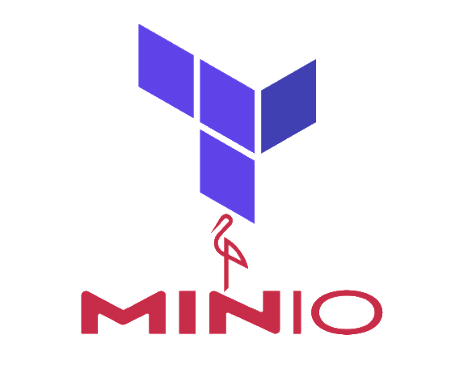

<p align="center">
  <a href="https://registry.terraform.io/providers/aminueza/minio/latest">
    
  </a>
</p>

<h1 align="center">Terraform Provider for MinIO</h1>

<p align="center">
  Manage <a href="https://min.io">MinIO</a> and S3-compatible object storage as code: buckets, objects, IAM, replication, encryption, and server configuration.
</p>

<p align="center">
  <a href="https://registry.terraform.io/providers/aminueza/minio/latest">
    
  </a>
  <a href="https://github.com/aminueza/terraform-provider-minio/actions/workflows/go.yml?query=branch%3Amain">
    
  </a>
  <a href="go.mod">
    
  </a>
  <a href="LICENSE">
    
  </a>
</p>

<p align="center">
  <a href="https://registry.terraform.io/providers/aminueza/minio/latest/docs"><b>Docs</b></a>
  &nbsp;·&nbsp;
  <a href="./examples"><b>Examples</b></a>
  &nbsp;·&nbsp;
  <a href="./.github/VISION.md"><b>Roadmap</b></a>
  &nbsp;·&nbsp;
  <a href="https://github.com/aminueza/terraform-provider-minio/discussions"><b>Discussions</b></a>
  &nbsp;·&nbsp;
  <a href="./.github/SECURITY.md"><b>Security</b></a>
</p>

---

Provision and manage [MinIO](https://min.io) with the same Terraform workflow you already use for the rest of your infrastructure. Define buckets, IAM users and policies, lifecycle and replication rules, encryption, and server configuration in HCL, then `plan` and `apply`. The provider talks to the MinIO S3 and Admin APIs directly and also drives other S3-compatible backends through a single compatibility switch.

## Highlights

- **Broad coverage**: 65 resources and 54 data sources spanning buckets and objects, IAM, ILM, replication, encryption, notifications, and server and cluster configuration.
- **Proven in production**: over 17 million downloads on the [Terraform Registry](https://registry.terraform.io/providers/aminueza/minio/latest), with frequent releases.
- **Flexible auth**: static keys, environment variables, STS AssumeRole, OIDC web identity (passwordless CI/CD), and mTLS.
- **Works beyond MinIO**: set `s3_compat_mode = true` to target Cloudflare R2, Backblaze B2, DigitalOcean Spaces, Hetzner Object Storage, and other S3-compatible stores.
- **Import everywhere**: every resource supports `terraform import`, so you can bring existing infrastructure under management.
- **AI-agent ready**: ships a [Claude Code](https://docs.claude.com/en/docs/claude-code) skill and an [`AGENTS.md`](./AGENTS.md) so coding agents produce correct configuration out of the box.

## Quick start

Pin the provider and describe what you want. The example below creates a bucket, a user, a policy scoped to that bucket, and attaches the two:

```hcl
terraform {
  required_providers {
    minio = {
      source  = "aminueza/minio"
      version = "~> 3.0"
    }
  }
}

provider "minio" {
  minio_server   = "localhost:9000"
  minio_user     = "minio"
  minio_password = "minio123"
}

resource "minio_s3_bucket" "app" {
  bucket = "app-data"
  acl    = "private"
}

resource "minio_iam_user" "app" {
  name = "app"
}

resource "minio_iam_policy" "app" {
  name   = "app-read-write"
  policy = <<-EOT
  {
    "Version": "2012-10-17",
    "Statement": [{
      "Effect": "Allow",
      "Action": ["s3:GetObject", "s3:PutObject"],
      "Resource": ["${minio_s3_bucket.app.arn}/*"]
    }]
  }
  EOT
}

resource "minio_iam_user_policy_attachment" "app" {
  user_name   = minio_iam_user.app.name
  policy_name = minio_iam_policy.app.name
}
```

```sh
terraform init
terraform apply
```

Credentials can also come from `MINIO_ENDPOINT`, `MINIO_USER`, and `MINIO_PASSWORD` instead of the `provider` block. See the [provider configuration](https://registry.terraform.io/providers/aminueza/minio/latest/docs) for every argument, and the [`examples`](./examples) directory for buckets, groups, service accounts, LDAP, and more.

## What you can manage

| Area | Resources include |
|------|-------------------|
| **Buckets & objects** | `s3_bucket`, `s3_object`, versioning, lifecycle, replication, CORS, quota, object lock, retention, tags, notifications, anonymous access |
| **IAM** | users, groups, policies, service accounts, group and policy attachments, LDAP and OpenID identity providers |
| **Encryption & KMS** | server-side encryption, `kms_key` |
| **Lifecycle (ILM)** | `ilm_policy`, `ilm_tier` |
| **Notifications & audit** | AMQP, Kafka, MQTT, MySQL, NATS, NSQ, Postgres, Redis, Elasticsearch, and webhook targets; audit and logger webhooks |
| **Server & cluster** | API, region, scanner, storage class, and heal config; site replication; pool decommission and rebalance; batch jobs |

Every area is mirrored by read-only data sources. Browse the full list in the [Terraform Registry documentation](https://registry.terraform.io/providers/aminueza/minio/latest/docs).

## S3-compatible backends

The provider is built for MinIO but works with other S3-compatible stores. Set `s3_compat_mode = true` and the provider gracefully skips features a backend does not implement (notifications, CORS, object lock, lifecycle) instead of failing:

```hcl
provider "minio" {
  minio_server   = "fsn1.your-objectstorage.com"
  minio_user     = var.access_key
  minio_password = var.secret_key
  minio_ssl      = true
  s3_compat_mode = true
}
```

Cloudflare R2, Backblaze B2, DigitalOcean Spaces, Hetzner Object Storage, and Versity Gateway are tested. The [provider docs](https://registry.terraform.io/providers/aminueza/minio/latest/docs) carry the per-backend support matrix and notes on region signing.

## Use with AI coding agents

This repository ships a [Claude Code](https://docs.claude.com/en/docs/claude-code) skill in [`skills/terraform-minio`](./skills/terraform-minio) that turns natural-language requests (for example, *"give this app a read-only key for the backups bucket"*) into correct `aminueza/minio` HCL and drives Terraform through a safe **plan → confirm → apply** workflow. Read operations run freely; mutating operations are gated behind a reviewed plan and explicit confirmation.

```sh
# Available in every project:
cp -R skills/terraform-minio ~/.claude/skills/

# Or scoped to this repo:
mkdir -p .claude/skills && cp -R skills/terraform-minio .claude/skills/
```

An [`AGENTS.md`](./AGENTS.md) at the repository root gives any agent the conventions, argument names, and error-handling patterns it needs to contribute here.

## Installing

Released builds are published to the [Terraform Registry](https://registry.terraform.io/providers/aminueza/minio/latest); the `required_providers` block above is all you need. Prebuilt binaries are also on the [Releases page](https://github.com/aminueza/terraform-provider-minio/releases).

To build and install from source, [install Task](https://taskfile.dev/docs/installation) and run:

```sh
task install
```

The plugin is placed in the correct local plugins directory for your operating system automatically.

## Development

```sh
task build          # compile the provider
task lint           # run golangci-lint
task test           # run acceptance tests (Docker required)
task generate-docs  # regenerate docs/ from templates/ and schema
```

Acceptance tests run against real MinIO instances via Docker Compose:

```sh
docker compose run --rm test

# Run a subset by name:
TEST_PATTERN=TestAccMinioS3Bucket_basic docker compose run --rm test
```

Full setup, project layout, and the MinIO consoles used during testing are covered in [CONTRIBUTING.md](./.github/CONTRIBUTING.md).

## Contributing

Contributions are welcome, from bug reports and feature requests to documentation and new resources. Start with [CONTRIBUTING.md](./.github/CONTRIBUTING.md) for the development setup and conventions, and see [GOVERNANCE.md](./.github/GOVERNANCE.md) for how decisions are made.

<a href="https://github.com/aminueza/terraform-provider-minio/graphs/contributors">
  
</a>

## Community & support

| | |
|--|--|
| 📖 Documentation | [Terraform Registry](https://registry.terraform.io/providers/aminueza/minio/latest/docs) |
| 🐛 Issues | [Report a bug or request a feature](https://github.com/aminueza/terraform-provider-minio/issues) |
| 💬 Discussions | [Ask questions and share ideas](https://github.com/aminueza/terraform-provider-minio/discussions) |
| 🔒 Security | [Report a vulnerability](./.github/SECURITY.md) |

## License

> [!IMPORTANT]
> Versions from v2.0.0 onward are distributed under the GNU AGPL-3.0 license. You are free to use, modify, and self-host the provider; if you distribute a modified version or offer it as a network service, you must make your source available under the same license.

See [LICENSE](./LICENSE) for the full text.

## Acknowledgments

- Every [contributor](https://github.com/aminueza/terraform-provider-minio/graphs/contributors) who has shaped this project.
- Built with the [Terraform Plugin SDKv2](https://developer.hashicorp.com/terraform/plugin/sdkv2).
- Powered by [MinIO](https://min.io) high-performance object storage.
